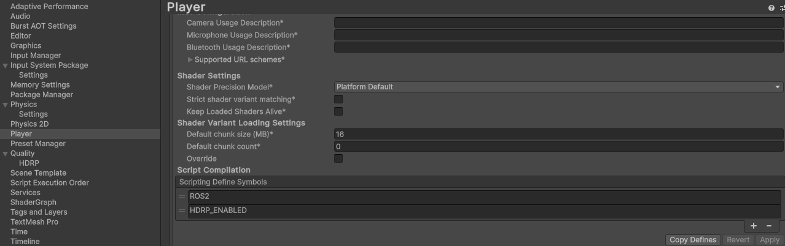

# HDRP Rendering and Water

If you wish to use the Unity Water system or simply interested in the High-Definition Render Pipeline (HDRP), you can still use our packages.
This folder contains some scripts and examples which integrate HDRP with our Water Query system the rest of the scripts. 

To enable HDRP:
1. Create a project with [HDRP enabled](https://docs.unity3d.com/Packages/com.unity.render-pipelines.high-definition@12.0/manual/Getting-started-with-HDRP.html)
2. Add the SMARC Unity Assets assets package to that Unity Project as normal [(see main readme)](../../README.md#installation-for-non-smarc-projects)
3. Add the compilation boolean to enable the HDRP assets to be compiled:
   1. In the Editor Go to: Edit → Project Settings → Player → Other Settings -> Scripting Define Symbols 
   2. Add the symbol "HDRP_ENABLED"

